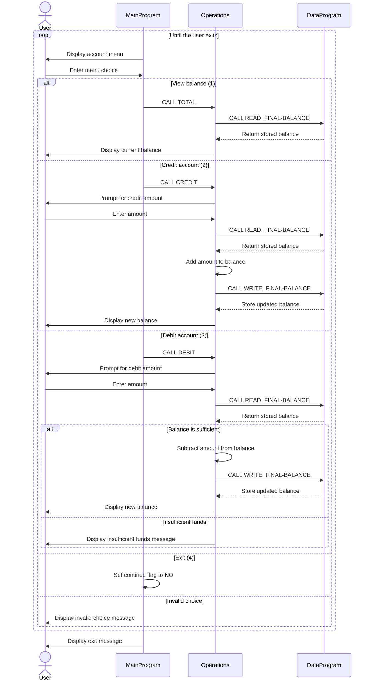

# COBOL Account Management

This directory documents the COBOL account-management example in `src/cobol/`.
The program provides a menu for viewing a balance, crediting an account, and
debiting an account.

## Source Files

- `src/cobol/main.cob` (`MainProgram`) displays the menu, reads the user's
  selection, and dispatches balance, credit, and debit requests to `Operations`.
  Selecting option 4 exits the program; other unrecognized selections display
  an error message.
- `src/cobol/operations.cob` (`Operations`) implements the account actions.
  It reads the current balance for display, prompts for an amount when crediting
  or debiting, and delegates balance reads and updates to `DataProgram`.
- `src/cobol/data.cob` (`DataProgram`) owns the stored balance. Its `READ`
  operation copies the stored balance to the caller, and `WRITE` replaces the
  stored balance with the caller-provided value.

## Student Account Rules

- The example currently models one shared account balance, initialized to
  `1000.00`. It does not store student names, IDs, or separate balances per
  student.
- A credit adds the entered amount to the stored balance.
- A debit is accepted only when the current balance is greater than or equal to
  the entered amount. Otherwise, the balance is unchanged and an insufficient
  funds message is displayed.
- The code does not validate that entered amounts are positive. It also does
  not persist the balance outside the running program.

## Sequence Diagram

